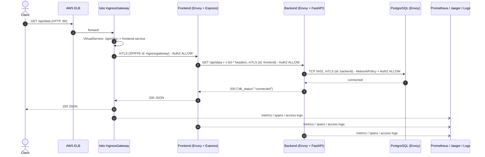

# Cloud-Native Microservices Platform: Zero-Trust Mesh & SRE Observability

[](https://opentofu.org/)
[](https://kubernetes.io/)
[](https://istio.io/)
[](https://aws.amazon.com/)
[](LICENSE)

A production-grade cloud-native platform demonstrating modern application lifecycle operations: multi-stage distroless container builds, declarative infrastructure with OpenTofu, zero-trust traffic mesh (mTLS), and Google SRE Golden Signal observability with chaos engineering resilience testing.

---

## Table of Contents

1. [Architecture Overview & Request Lifecycle](#1-architecture-overview--request-lifecycle)
2. [Platform Capabilities & Compliance Matrix](#2-platform-capabilities--compliance-matrix)
3. [Technology Rationale & Design Decisions](#3-technology-rationale--design-decisions)
4. [Repository Structure](#4-repository-structure)
5. [Prerequisites & Local Tooling](#5-prerequisites--local-tooling)
6. [Step-by-Step Deployment Runbook](#6-step-by-step-deployment-runbook)
7. [Observability & SRE Golden Signals](#7-observability--sre-golden-signals)
8. [Chaos Engineering & Resilience Testing](#8-chaos-engineering--resilience-testing)
9. [Decommissioning & Teardown](#9-decommissioning--teardown)

---

## 1. Architecture Overview & Request Lifecycle

The platform provisions a multi-tier microservice architecture decoupled into presentation, business logic, and relational persistence layers.

```text
                                   NORTH - SOUTH TRAFFIC
                                            │
                                [ Public Internet Request ]
                                            │
                                            ▼
                           ┌───────────────────────────────────┐
                           │   AWS Elastic Load Balancer       │
                           └────────────────┬──────────────────┘
                                            │
                                            ▼
                           ┌───────────────────────────────────┐
                           │      Istio Ingress Gateway        │ (Edge L7 Routing)
                           └────────────────┬──────────────────┘
────────────────────────────────────────────┼────────────────────────────────────────────
                                            │ EAST - WEST TRAFFIC (Strict mTLS)
                                            ▼
                           ┌───────────────────────────────────┐
                           │     Frontend Pod (Express)        │
                           │  ┌───────────┐   ┌──────────────┐ │
                           │  │   Envoy   │───│  Node.js     │ │
                           │  │  Sidecar  │   │ (Distroless) │ │
                           │  └───────────┘   └──────────────┘ │
                           └────────────────┬──────────────────┘
                                            │ (Encrypted SPIFFE mTLS)
                                            ▼
                           ┌───────────────────────────────────┐
                           │     Backend Pod (FastAPI)         │
                           │  ┌───────────┐   ┌──────────────┐ │
                           │  │   Envoy   │───│  Python      │ │
                           │  │  Sidecar  │   │ (Distroless) │ │
                           │  └───────────┘   └──────────────┘ │
                           └────────────────┬──────────────────┘
                                            │ (mTLS TCP + NetworkPolicy)
                                            ▼
                           ┌───────────────────────────────────┐
                           │     Stateful Database Pod         │
                           │  ┌───────────┐   ┌───────────┐    │
                           │  │   Envoy   │───│PostgreSQL │    │
                           │  │  Sidecar  │   │ (Storage) │    │
                           │  └───────────┘   └─────┬─────┘    │
                           └────────────────────────┼──────────┘
                                                    ▼
                                           [ AWS EBS (gp2) PVC ]
```

### Flow Walkthrough (Step-by-step request flow)

1. **North-South Ingress**: The client calls `http://<ELB-hostname>/api/data`. The AWS Elastic Load Balancer (provisioned by the `istio-ingressgateway` `LoadBalancer` Service) forwards it to the Istio IngressGateway — the only public entry point of the cluster.
2. **Edge Routing**: The `Gateway` + `VirtualService` (`k8s/mesh/gateway.yaml`) match the path and route `/api/data` and `/` to `frontend-service:3000`. The backend and database have no external route.
3. **East-West mTLS + Authorization**: The gateway Envoy opens an mTLS connection to the frontend sidecar (`PeerAuthentication: STRICT`). The frontend sidecar checks the caller's SPIFFE identity against `AuthorizationPolicy` (only `istio-ingressgateway-service-account` is allowed).
4. **Frontend → Backend**: Express calls `backend-service:8000/api/data`, forwarding the `x-request-id` / `x-b3-*` headers. The backend sidecar only accepts the `frontend` ServiceAccount identity; anything else gets `403 RBAC: access denied`.
5. **Backend → PostgreSQL**: The backend opens a TCP connection to `postgres-db:5432`. It is allowed twice: by the `NetworkPolicy` (L3/L4, only pods labelled `app: backend`) and by the `AuthorizationPolicy` (L7 identity, only the `backend` ServiceAccount).
6. **Response + Telemetry**: The response travels back the same path. Every Envoy hop emits Prometheus metrics (`istio_requests_total`, `istio_request_duration_milliseconds`), a Zipkin/B3 span sent to Jaeger, and an access-log line on stdout.



## 2. Platform Capabilities & Compliance Matrix

| Capability Domain            | Architecture Specification                                                          | Target Technology                                  | Verification / Invariant Test                                                                                        |
| :--------------------------- | :---------------------------------------------------------------------------------- | :------------------------------------------------- | :------------------------------------------------------------------------------------------------------------------- |
| **Compute & Runtime**        | Multi-tier microservices with relational persistence                                | Python (FastAPI), Node.js (Express), PostgreSQL 16 | Zero-shell distroless container runtime (`gcr.io/distroless`); non-root execution (`UID 65532`).                     |
| **Traffic Ingress (N-S)**    | Managed API Gateway & edge routing as single cluster entry point                    | AWS ELB + Istio IngressGateway                     | Single entry point; `Gateway` + `VirtualService` route `/api/data` and `/` to the frontend. Backend/DB are not exposed. |
| **Zero-Trust Network (E-W)** | Transparent mTLS with cryptographic workload identity and intra-cluster restriction | Istio `PeerAuthentication` (`STRICT`), `AuthorizationPolicy`, K8s `NetworkPolicy` | mTLS everywhere; identity allow-list gateway→frontend→backend→postgres (others get 403); NetworkPolicy drops DB traffic from non-backend pods. |
| **SRE Observability**        | Telemetry scraping of Golden Signals, centralized logs, and distributed tracing     | Prometheus, Grafana, Jaeger                        | `PodMonitor` scrapes every Envoy sidecar; Grafana Golden Signals dashboard (`reporter="destination"`); Jaeger waterfalls via Istio Zipkin/B3 provider; Envoy access logs on stdout. |
| **Resilience & Chaos**       | Self-healing pod recovery and error detection via Chaos Engineering                 | Kubernetes Controllers, Chaos injection scripts    | `scripts/chaos.sh`: pod kill, backend outage, Istio fault injection (HTTP 500) — detected in Grafana, Jaeger and logs. |

---

## 3. Technology Rationale & Design Decisions

### OpenTofu vs. Proprietary Terraform

- **Open Source Governance:** Maintained under the Linux Foundation using the permissive Mozilla Public License v2.0 (MPL-2.0), avoiding HashiCorp's Business Source License (BSL/BUSL 1.1) commercial restrictions.
- **Licensing Compliance:** Guarantees enterprise infrastructure codebases remain free from vendor lock-in or licensing disputes.
- **Drop-in Compatibility:** Direct drop-in binary compatibility (tofu init, tofu plan, tofu apply) supporting AWS providers, local CLI commands, and native S3 remote state locking (eliminating the need for DynamoDB).

### Hardened Multi-Stage Distroless Containers

- **CVE Footprint Elimination:** The build stage compiles binaries and resolves packages inside heavy builder images, while the runtime stage selectively copies only compiled executables into `gcr.io/distroless` containers.
- **Attack Surface Reduction:** Stripping package managers (`apt`, `apk`), system utilities, and interactive shells (`/bin/sh`, `/bin/bash`) eliminates the attack surface by preventing arbitrary command execution inside compromised pods.
- **Rapid Startup Performance:** Omission of OS userland components keeps the runtime images small, speeding up CI builds and node-level container pulls.

### Istio Service Mesh & Zero-Trust Architecture

- **Non-Invasive Mutual TLS:** Secures internal pod-to-pod communications via SPIFFE identities and strict mTLS without modifying application source code.
- **Decoupled Traffic Management:** Handles circuit breaking, timeouts, connection pooling, and canary routing entirely within Envoy proxy sidecars.
- **Standardized Golden Signals:** Envoy sidecars emit uniform Prometheus metrics and distribute B3/W3C trace spans across disparate programming runtimes (Node.js and Python).

---

## 4. Repository Structure

```text
├── apps/
│   ├── backend/                                     # Python FastAPI service (/healthz, /metrics, /api/data)
│   │   ├── src/main.py
│   │   ├── Dockerfile                               # Multi-stage distroless build (UID 65532)
│   │   └── requirements.txt
│   └── frontend/                                    # Node.js Express service (B3 header forwarding)
│       ├── src/index.js
│       ├── Dockerfile                               # Multi-stage distroless build (UID 65532)
│       └── package.json
├── k8s/
│   ├── base/                                        # Agnostic core manifests (Kustomize)
│   │   ├── backend/backend.yaml                     # ServiceAccount, Deployment, ClusterIP Service
│   │   ├── database/postgres.yaml                   # ServiceAccount, StatefulSet, Headless Service, PVC
│   │   ├── frontend/frontend.yaml                   # ServiceAccount, Deployment, ClusterIP Service
│   │   └── kustomization.yaml
│   ├── mesh/                                        # Istio zero-trust configuration
│   │   ├── istio-operator.yaml                      # Control plane: access logs + Zipkin tracing provider
│   │   ├── gateway.yaml                             # IngressGateway listener + VirtualService routing
│   │   ├── peer-authentication.yaml                 # STRICT mTLS enforcement
│   │   ├── authorization-policies.yaml              # SPIFFE identity allow-lists per service
│   │   └── network-policies.yaml                    # L3/L4 database isolation
│   ├── observability/                               # Telemetry stack manifests
│   │   ├── prometheus-values.yaml                   # kube-prometheus-stack Helm values
│   │   ├── istio-podmonitor.yaml                    # Scrape Envoy sidecar/gateway metrics
│   │   ├── grafana-dashboard-goldensignals.yaml     # Golden Signals dashboard ConfigMap
│   │   ├── jaeger-all-in-one.yaml                   # Jaeger (Zipkin :9411 collector + UI :16686)
│   │   └── telemetry-tracing.yaml                   # Istio Telemetry: 100% sampling to Jaeger
│   ├── chaos/
│   │   └── fault-injection.yaml                     # Istio HTTP 500 fault injection experiment
│   └── overlays/
│       ├── aws/                                     # ECR image rewrites
│       ├── azure/                                   # Placeholder (multi-cloud parity)
│       └── gcp/                                     # Placeholder (multi-cloud parity)
├── scripts/
│   ├── bootstrap-aws.sh                             # Provisions S3 state bucket (native locking) and ECR
│   ├── teardown-aws.sh                              # Decommissions cloud bootstrap assets
│   ├── test-traffic.sh                              # Continuous load generator via the IngressGateway
│   └── chaos.sh                                     # Chaos experiments (pod kill, outage, fault injection)
└── opentofu/
    ├── aws/                                         # VPC, EKS (VPC CNI with NetworkPolicy enabled), IAM
    ├── azure/                                       # Placeholder
    └── gcp/                                         # Placeholder
```

## 5. Prerequisites & Local Tooling

Ensure the following tools are installed and available on your system execution path:

- **OpenTofu:** `tofu version` (>= 1.8.x)
- **AWS CLI:** `aws --version` (>= 2.15.x)
- **Docker CLI:** `docker version` (>= 24.x)
- **Kubernetes CLI:** `kubectl version --client` (>= 1.28.x)
- **Istio CLI:** `istioctl version` (>= 1.22.x)
- **Helm:** `helm version` (>= 3.14.x)
- **curl / jq:** Command-line utilities for payload generation and telemetry parsing

### Local AWS Authentication

Before executing any infrastructure scripts, you must authenticate your local terminal with an AWS IAM User that possesses `AdministratorAccess`. **Do not use the AWS Root account.**

```bash
# Configure your local AWS profile (Requires AWS_ACCESS_KEY_ID and AWS_SECRET_ACCESS_KEY)
aws configure

# Verify your active identity
aws sts get-caller-identity
```

## 6. Step-by-Step Deployment Runbook

### Step 1: Bootstrap Cloud Storage & Registries

Execute the bootstrap automation script to initialize remote state storage (S3 bucket with native locking) and private Amazon ECR repositories:

```bash
chmod +x scripts/*.sh
./scripts/bootstrap-aws.sh
```

### Step 2: Provision Infrastructure with OpenTofu

Initialize the AWS provider modules, inspect the execution plan, and provision the VPC network and Amazon EKS cluster:

```bash
cd opentofu/aws

AWS_REGION="eu-south-2"
ACCOUNT_ID=$(aws sts get-caller-identity --query Account --output text)
BUCKET_NAME="tofu-state-cloudnative-${ACCOUNT_ID}-${AWS_REGION}"

tofu init \
  -backend-config="bucket=${BUCKET_NAME}" \
  -backend-config="region=${AWS_REGION}"

tofu apply

# Authenticate local kubectl context with the newly provisioned Amazon EKS cluster
aws eks update-kubeconfig --region eu-south-2 --name prod-cloud-native-eks
kubectl get nodes
cd ../..
```

### Step 3: Build & Push Hardened Container Images

Log in to Amazon ECR, build the multi-stage distroless containers directly with your release tags, and push them to your private registry:

```bash
AWS_ACCOUNT_ID=$(aws sts get-caller-identity --query Account --output text)
AWS_REGION="eu-south-2"
ECR_URL="${AWS_ACCOUNT_ID}.dkr.ecr.${AWS_REGION}.amazonaws.com"

# 1. Log Docker into the private Amazon ECR registry
aws ecr get-login-password --region "$AWS_REGION" | docker login --username AWS --password-stdin "$ECR_URL"

# 2. Build Backend image directly with the ECR target tag
docker build -t "${ECR_URL}/backend-app:v1.0.3" apps/backend

# 3. Build Frontend image directly with the ECR target tag
docker build -t "${ECR_URL}/frontend-app:v1.0.0" apps/frontend

# 4. Push both images to Amazon ECR
docker push "${ECR_URL}/backend-app:v1.0.3"
docker push "${ECR_URL}/frontend-app:v1.0.0"
```

### Step 4: Install Istio Service Mesh

Deploy the Istio control plane (default profile + Envoy access logs + Zipkin tracing provider pointing to Jaeger) and label the workload namespace for automatic Envoy sidecar injection:

```bash
istioctl install -f k8s/mesh/istio-operator.yaml -y
kubectl label namespace default istio-injection=enabled --overwrite
# Verify that istio-ingressgateway and istiod pods are running
kubectl get pods -n istio-system
```

### Step 5: Deploy Application Workloads & Zero-Trust Mesh

To maintain repository portability and avoid hardcoding cloud provider IDs, the deployment runbook dynamically injects your live AWS Account ID into the committed AWS Kustomize overlay at runtime:

```bash
AWS_ACCOUNT_ID=$(aws sts get-caller-identity --query Account --output text)
AWS_REGION="eu-south-2"
ECR_URL="${AWS_ACCOUNT_ID}.dkr.ecr.${AWS_REGION}.amazonaws.com"

# Navigate to the AWS overlay and inject the live ECR registry URL
cd k8s/overlays/aws
kustomize edit set image backend-app=${ECR_URL}/backend-app:v1.0.3
kustomize edit set image frontend-app=${ECR_URL}/frontend-app:v1.0.0

# Deploy core workloads (Frontend, Backend, PostgreSQL) via the AWS Kustomize overlay
kubectl apply -k .

# Discard local changes to kustomization.yaml to keep git status clean (simulating ephemeral CI/CD runners)
git checkout kustomization.yaml

# Return to root and apply Zero-Trust Mesh configurations (Strict mTLS, Ingress Gateway, AuthorizationPolicies, Network Policies)
cd ../../../
kubectl apply -f k8s/mesh/peer-authentication.yaml -f k8s/mesh/gateway.yaml \
  -f k8s/mesh/authorization-policies.yaml -f k8s/mesh/network-policies.yaml

# Verify rollout status across all deployments
kubectl rollout status deployment/frontend --timeout=120s
kubectl rollout status deployment/backend --timeout=120s
kubectl rollout status statefulset/postgres-db --timeout=120s
```

### Step 6: Deploy Observability Stack

Deploy the Prometheus/Grafana stack via Helm and configure the Jaeger tracing backend for capturing distributed spans:

```bash
# Create the monitoring namespace
kubectl create namespace monitoring --dry-run=client -o yaml | kubectl apply -f -

# Add and update Prometheus community helm chart
helm repo add prometheus-community https://prometheus-community.github.io/helm-charts
helm repo update

# Install kube-prometheus-stack
helm upgrade --install prometheus-stack prometheus-community/kube-prometheus-stack \
  --namespace monitoring \
  --version 60.0.0 \
  -f k8s/observability/prometheus-values.yaml \
  --wait

# Scrape Envoy sidecar metrics (istio_requests_total, istio_request_duration_milliseconds)
kubectl apply -f k8s/observability/istio-podmonitor.yaml

# Apply Jaeger tracing backend
kubectl apply -f k8s/observability/jaeger-all-in-one.yaml

# Apply Golden Signals Dashboard ConfigMap
kubectl apply -f k8s/observability/grafana-dashboard-goldensignals.yaml

# Apply Istio tracing telemetry
kubectl apply -f k8s/observability/telemetry-tracing.yaml

# Ensure all components of the monitoring stack and Jaeger are running successfully in the monitoring namespace
kubectl get pods -n monitoring
```

---

## 7. Observability & SRE Golden Signals

### Local Telemetry Dashboard Access

Forward local ports to inspect Prometheus metrics, Grafana dashboards, and Jaeger traces directly:

```bash
# Verify Grafana Admin Access & Password Retrieval
kubectl --namespace monitoring get secrets prometheus-stack-grafana -o jsonpath="{.data.admin-password}" | base64 -d ; echo

# Access Grafana Dashboards - http://localhost:3000 (User: admin, password from above command)
# Start port forwaring in the background
kubectl port-forward -n monitoring svc/prometheus-stack-grafana 3000:80 &

# Access Jaeger Distributed Tracing UI
# Start port forwaring in the background
kubectl port-forward -n monitoring svc/jaeger 16686:16686 &

# Logs: application logs and Envoy access logs (response code, flags, x-request-id)
kubectl logs -l app=frontend -c frontend -f
kubectl logs -l app=frontend -c istio-proxy -f
```

### Google SRE Golden Signal PromQL Queries

The golden rule for Istio metrics collection is to always filter by `reporter="destination"`. Istio records telemetry on both the client sidecar (`reporter="source"`) and the server sidecar (`reporter="destination"`). Omitting this label causes duplicate request counts.

- **Traffic (Rate - Requests Per Second):**

  ```promql
  sum(rate(istio_requests_total{reporter="destination", destination_service_name="backend"}[5m]))
  ```

  _Calculates the per-second rate of incoming requests over a 5-minute window for the target backend service._

- **Errors (Ratio of HTTP 5xx Failures):**

  ```promql
  (
    sum(rate(istio_requests_total{reporter="destination", destination_service_name="backend", response_code=~"5.*"}[5m]))
    or
    vector(0)
  )
  /
  sum(rate(istio_requests_total{reporter="destination", destination_service_name="backend"}[5m]))
  ```

  _Calculates the proportion of 5xx server errors divided by total traffic. The `or vector(0)` operator prevents the expression from returning `NaN` / `No Data` when the service is healthy and zero errors exist._

- **Latency (Percentile 95 - p95):**

  ```promql
  histogram_quantile(
    0.95,
    sum(rate(istio_request_duration_milliseconds_bucket{reporter="destination", destination_service_name="backend"}[5m])) by (le)
  )
  ```

  _Calculates the 95th percentile latency in milliseconds across aggregated histogram bucket boundaries (`by (le)`)._

- **Canary Latency Comparison:**
  ```promql
  histogram_quantile(
    0.95,
    sum(rate(istio_request_duration_milliseconds_bucket{reporter="destination", destination_service_name="backend"}[5m])) by (le, destination_version)
  )
  ```
  _Emits side-by-side time series comparing the p95 latency profile of canary deployments across active versions._

### Distributed Context Propagation

To preserve distributed trace continuity inside Jaeger, the Express frontend extracts incoming tracing headers and forwards them down to the FastAPI backend:

- `x-request-id`: Edge UUID used for end-to-end log correlation.
- `x-b3-traceid`: Root transaction identity across the entire microservice call tree.
- `x-b3-spanid`: Unique identifier for the immediate child execution segment.
- `x-b3-parentspanid`: Identifier of the calling span for hierarchical waterfall reconstruction.
- `x-b3-sampled`: Proxy sampling flag determining span persistence.

---

## 8. Chaos Engineering & Resilience Testing

Start the load generator in one terminal and keep Grafana (**Microservices Golden Signals Dashboard**, auto-refresh 5s) and Jaeger open:

```bash
./scripts/test-traffic.sh          # prints HTTP status per request (green 200 / red 5xx)
```

### Scenario 1: Error Injection (Istio Fault Injection)

```bash
./scripts/chaos.sh fault-on        # 50% of frontend -> backend calls abort with HTTP 500
# ... observe ~1-2 minutes ...
./scripts/chaos.sh fault-off
```

Detection:
- **Metrics (Grafana)**: `Errors (5xx %)` for `frontend-service` jumps to ~50%; `Responses by code` shows a `503` series.
- **Traces (Jaeger)**: service `istio-ingressgateway.istio-system`, tag `error=true` → waterfall shows the frontend returning 503 and the backend span with `500` / response flag `FI` (fault injected).
- **Logs**: `kubectl logs -l app=frontend -c frontend` → `Backend call failed: Request failed with status code 500`; `kubectl logs -l app=frontend -c istio-proxy` → `"GET /api/data" 500 FI fault_filter_abort`.

### Scenario 2: Pod Drop / Backend Outage & Self-Healing

```bash
./scripts/chaos.sh pod-kill        # delete all backend pods; ReplicaSet recreates them
# or a longer, more visible outage:
./scripts/chaos.sh backend-down    # scale to 0 -> frontend answers 503
./scripts/chaos.sh backend-up      # scale back to 2 -> recovery
```

Detection: `Available replicas` panel drops to 0 and returns to 2, the 5xx panel spikes and returns to 0%, Jaeger shows 503 traces with the backend call failing (`no healthy upstream`), and the frontend logs `Backend call failed`.

### Scenario 3: Zero-Trust Invariants

```bash
# L3/L4: un-meshed pod -> PostgreSQL is dropped by the NetworkPolicy (expected: Connection timed out)
kubectl run lateral-attack --rm -i --restart=Never --image=busybox \
  --overrides='{"metadata":{"annotations":{"sidecar.istio.io/inject":"false"}}}' -- \
  nc -zv -w 3 postgres-db-0.postgres-db 5432

# L7: meshed pod with a non-allowed identity -> backend (expected: RBAC: access denied HTTP 403)
kubectl run rogue --restart=Never --image=curlimages/curl -- \
  sh -c 'sleep 5; curl -s -w " HTTP %{http_code}\n" http://backend-service:8000/api/data'
sleep 20; kubectl logs rogue -c rogue; kubectl delete pod rogue
```

> NetworkPolicy enforcement on EKS requires the VPC CNI addon with `enableNetworkPolicy = "true"` (configured in `opentofu/aws/eks.tf`).

---

## 9. Decommissioning & Teardown

To avoid unnecessary cloud consumption costs, destroy all cloud resources in reverse order:

```bash
# Delete Istio components, application workloads, and load balancer services
istioctl uninstall --purge -y
kubectl delete -k k8s/overlays/aws/
kubectl delete -f k8s/mesh/
kubectl delete -k k8s/base/
kubectl delete svc --all -n default

# Give AWS a moment to clean up the NLBs, then run OpenTofu destroy
# Decommission EKS cluster and VPC infrastructure
cd opentofu/aws
tofu destroy -auto-approve
cd ../..

# Delete ECR repositories and S3 state storage
./scripts/teardown-aws.sh
```

## 10. Troubleshooting

**Docker Login Error (Linux/Fedora): `pass not initialized`**
If you encounter a credential store error when piping the AWS STS token to `docker login` on Linux (as in [Step 3: Build & Push Hardened Container Images](#step-3-build--push-hardened-container-images)), it is likely because Docker defaults to using `pass` (a password manager) which may not be initialized with a GPG key on your local machine.

You can temporarily bypass this credential helper by backing up your Docker config before authenticating:

```bash
mv ~/.docker/config.json ~/.docker/config.json.backup
# Retry the AWS ECR login command
```

**EKS Pod Creation Stuck / Istio Webhook Timeout**
If pods are stuck and event logs show FailedCreate with context deadline exceeded calling the Istio sidecar injector webhook:

```
Error creating: Internal error occurred: failed calling webhook "namespace.sidecar-injector.istio.io": failed to call webhook: Post "https://istiod.istio-system.svc:443/inject?timeout=10s": context deadline exceeded
```

By default, the AWS-managed EKS control plane security group only allows outbound traffic to worker nodes on standard Kubernetes ports (like 443 and 10250). Istio's sidecar injection webhook relies on port 15017. To fix this, your OpenTofu EKS module must include an explicit security group rule allowing the control plane to reach port 15017 on your worker nodes. (Note: This has already been applied in opentofu/aws/eks.tf).

**Failing to desroy Internet Gateway and Subnet**
When you try to destroy your AWS infrastructure you can see an below errors

```
Error: deleting EC2 Internet Gateway (<IGW_ID>): detaching EC2 Internet Gateway (<IGW_ID>) from VPC (<VPC_ID>): operation error EC2: DetachInternetGateway, https response error StatusCode: 400, RequestID: <REQUEST_ID>, api error DependencyViolation: Network <VPC_ID> has some mapped public address(es). Please unmap those public address(es) before detaching the gateway.

Error: deleting EC2 Subnet (<SUBNET_ID>): operation error EC2: DeleteSubnet, https response error StatusCode: 400, RequestID: <REQUEST_ID>, api error DependencyViolation: The subnet '<SUBNET_ID>' has dependencies and cannot be deleted.
```

The DependencyViolation error occurs because AWS Network Load Balancers (NLBs) or Elastic Network Interfaces (ENIs) were dynamically created in your subnets by Kubernetes (specifically by your Istio IngressGateway or services of type: LoadBalancer).

Because these load balancers were spun up dynamically inside your cluster after OpenTofu provisioned the VPC and EKS cluster, OpenTofu's state file doesn't track them directly. When OpenTofu tries to tear down the VPC, subnets, and Internet Gateway, AWS blocks the deletion because those lingering load balancers are still holding public IP addresses and active attachments inside your subnets.

Either delete AWS load balancer via console and rerun tofu destroy. If you follow [## 9. Decommissioning & Teardown](#9-decommissioning--teardown) instructions and perform clean up of Kubernetes resources first you should not see this error.
